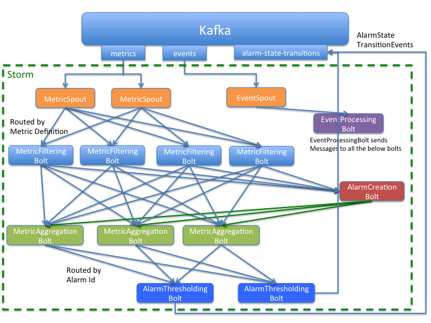

mon-thresh
==========

Monitoring Thresholding Engine

Computes thresholds on metrics and publishes alarms to the MessageQ when exceeded.
Based on Apache Storm, a free and open distributed real-time computation system. Also uses Apache Kafka, a high-throughput distributed messaging system.



Alarms have three possible states: `UNDETERMINED`, `OK` and `ALARM`.  Alarms are defined by an expression. For example: 

```
avg(cpu{service=nova}, 120) > 90 or avg(load{service=nova}, 120) > 15
```

If the expression evaluates to true, the Alarm state transitions to `ALARM`, if it evaluates to false, the state transitions to `OK` and if there aren't any metrics for the two times the measuring period, the Alarm state transitions to `UNDETERMINED`. Each part of the expression is represented by a Sub Alarm, so for the above example, there are two Sub Alarms.

The Threshold Engine is designed as a series of Storm Spouts and Bolts. For an overview of Storm, look at [the tutorial][storm-tutorial]. Spouts feed external data into the system as messages while bolts process incoming messages and optionally produce output messages for a downstream bolt.

The flow of Metrics is MetricSpout to MetricFilteringBolt to MetricAggregationBolt. The MetricSpout reads from Kakfa and sends it on through Storm. Metrics are routed to a specific MetricFilteringBolt based on a routing algorithm that computes a hash code like value based on the Metric Definition so a Metric with the same MetricDefinition is always routed to the same MetricFilteringBolt. The MetricFilteringBolt looks up the Metric Definition and decides if it should be sent on to a MetricAggregationBolt using the same routing algorithm. The MetricAggregationBolt adds the Metric information to its total for each SubAlarms and once a minute evaluates each SubAlarm it has.

So, each Metric is routed through one of the MetricFilteringBolts. The MetricAggregationBolts processes many fewer Metrics because few Metrics are associated with an Alarm.

Once a minute, the MetricAggregationBolts use the Aggregated Metrics to evaluate each Sub Alarms. If the state changes on the Sub Alarm, the state change is forwarded to the AlarmThresholdingBolts. The AlarmThresholdingBolts look at the entire Alarm Expression to evaluate the state of the Alarm.

Events also flow into the Threshold Engine via Kafka so the Threshold Engine knows about Alarm creations, updates and deletes. The EventSpout reads the Events from Kafka and sends them to the appropriate bolts.

=======
# License

Copyright (c) 2014 Hewlett-Packard Development Company, L.P.

Licensed under the Apache License, Version 2.0 (the "License");
you may not use this file except in compliance with the License.
You may obtain a copy of the License at

    http://www.apache.org/licenses/LICENSE-2.0
    
Unless required by applicable law or agreed to in writing, software
distributed under the License is distributed on an "AS IS" BASIS,
WITHOUT WARRANTIES OR CONDITIONS OF ANY KIND, either express or
implied.
See the License for the specific language governing permissions and
limitations under the License.

[storm-tutorial]: http://storm.incubator.apache.org/documentation/Tutorial.html

